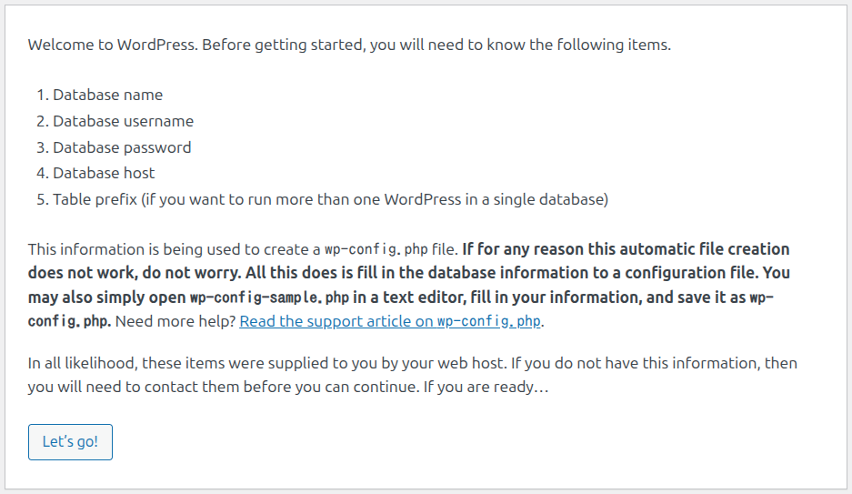
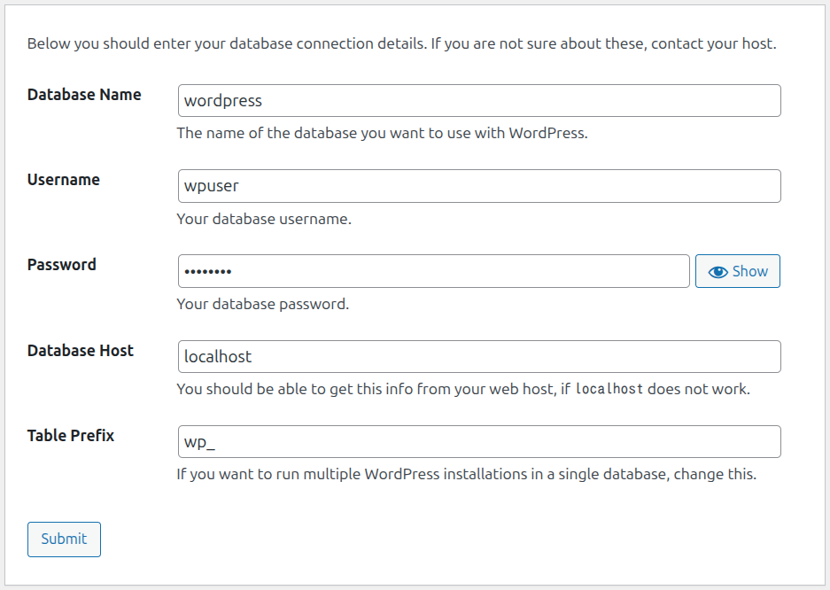
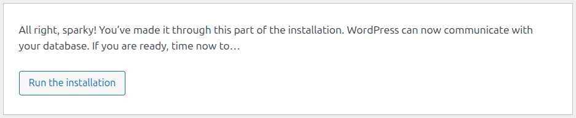
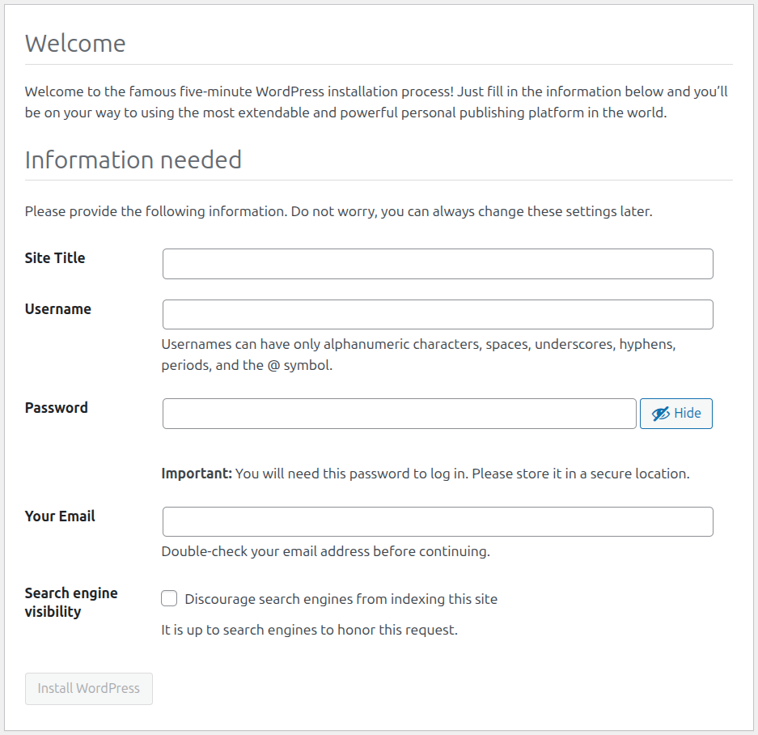

# ReactでWordPressのREST APIを叩いてみよう(?)

## 構成（多分こんな感じ）
```text
Windows 11
├─ Node.js
│   └─ React
└─ VMware Workstation Pro
    └─ Ubuntu 26.04
        ├─ Apache
        │   └─ PHP
        │       └─ WordPress
        ├─ MySQL
        └─ OpenSSH Server (なくてもOK)
```
## 0. 目次
1. Ubuntu準備
2. Windows準備
3. Ubuntu作業
4. Windows作業

## 1. Ubuntu準備

更新
```bash
sudo apt update
sudo apt upgrade -y
```

IPアドレス確認
```bash
hostname -I
```

SSHサーバインストール（しなくてもOK、しないなら「3. Ubuntu作業」へ）
```bash
sudo apt install openssh-server -y
sudo systemctl enable ssh
sudo systemctl start ssh
```

## 2. Windows準備
WindowsからUbuntuにSSH接続
```bash
ssh [ユーザ名]@[Ubuntu IPアドレス]
```

## 3. Ubuntu作業
### 3.1 Apache
インストール
```bash
sudo apt install apache2 -y
```

起動確認
```bash
sudo systemctl status apache2
```

AllowOverride設定変更
```bash
sudo nano /etc/apache2/apache2.conf
```
```bash
<Directory /var/www/>
  Options Indexes FollowSymLinks
  - AllowOverride None
  + AllowOverride All
  Require all granted
</Directory>
```

モジュール有効化
```bash
sudo a2enmod rewrite
sudo a2enmod headers
```

Apache再起動
```bash
sudo systemctl restart apache2
```

***
### 3.2. MySQL

インストール
```bash
sudo apt install mysql-server -y
```

起動確認
```bash
sudo systemctl status mysql
```

設定
```bash
sudo mysql
```
WordPress用データベース作成
```bash
CREATE DATABASE wordpress;
```
WordPress用ユーザ作成
```bash
CREATE USER 'wpuser'@'localhost' IDENTIFIED BY 'P@ssw0rd';
GRANT ALL PRIVILEGES ON wordpress.* TO 'wpuser'@'localhost';
```
更新/終了
```bash
FLUSH PRIVILEGES;
EXIT;
```

***
### 3.3. PHP
インストール
```bash
sudo apt install php libapache2-mod-php php-mysql php-curl php-gd php-xml php-mbstring php-zip unzip -y
```

***
### 3.4. WordPress
ダウンロード
```bash
cd /tmp
wget https://wordpress.org/latest.tar.gz
tar -xvf latest.tar.gz
```
フォルダ移動/権限変更
```bash
sudo mv wordpress /var/www/html/
sudo chown -R www-data:www-data /var/www/html/wordpress
```

設定（よくわからないです）
```bash
sudo nano /var/www/html/wordpress/.htaccess
```
```bash
# BEGIN WordPress
<IfModule mod_rewrite.c>
    RewriteEngine On
    RewriteBase /wordpress/
    RewriteRule ^index\.php$ - [L]
    RewriteCond %{REQUEST_FILENAME} !-f
    RewriteCond %{REQUEST_FILENAME} !-d
    RewriteRule . /wordpress/index.php [L]
</IfModule>
# END WordPress
```

ブラウザで `http://[Ubuntu IPアドレス]/wordpress/` へアクセスし、「Let's go!」をクリック（下図）


3.2.の設定を入力して「Submit」をクリック（下図）


「Run the installation」をクリック（下図）


必要事項を入力して、「Install WordPress」をクリック（下図）


ブラウザで
`http://[Ubuntu IPアドレス]/wordpress/wp-json` へアクセス

JSONが表示されればOK

## 4. Windows作業
プロジェクト作成
```bash
npx create-react-app my-app
cd my-app
```

`my-app/src/app.js`を編集
```js
import { useEffect, useState } from "react";

function App() {
  const [pages, setPages] = useState([]);

  useEffect(() => {
    fetch("http://[Ubuntu IPアドレス]/wordpress/wp-json/wp/v2/pages")
      .then((res) => res.json())
      .then((data) => {
        setPages(data);
      })
      .catch((err) => console.error(err));
  }, []);

  return (
    <div className="App">
      <h1>mini site</h1>
      <ul>
        {pages.map((page) => (
          <li key={page.id}>
            {page.title.rendered}
          </li>
        ))}
      </ul>
    </div>
  );
}
export default App;
```

npm実行
```bash
npm start
```
